# SPACE R1DE
Welcome to SPACE R1DE, the product that helps you make your dreams come true and send you to space. 

SPACE R1DE was built to address the longing of people who want to travel beyond our planet and discover new places in our universe. During the registration process, customers have the option to choose among 3 different planets to travel to.

[Link to the website](https://dev-timm.github.io/space-ride/)

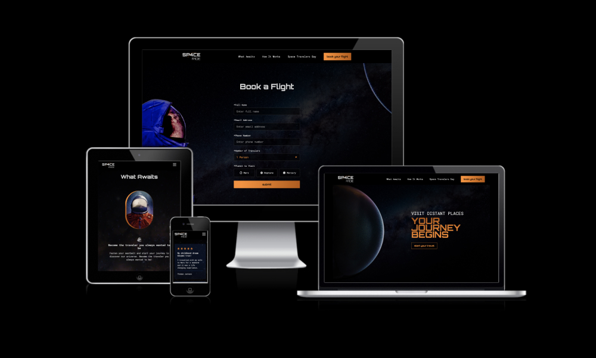

## Product Decisions 

### Business Needs
As a company...
- we want to be one of the first businesses that offer private space travel so that we can be ahead of the competition early on.
- we want to appeal to our target audience from the very first page visit to make them excited about the product we are offering.
- we want to make sure our product is secure so that our staff and customers feel safe far away from home.
- we want to make it as easy as possible for potential customers to get in touch with us.
- we want to increase the stickiness of our product so that we ensure the retention of our customers base.

### User Needs
As a space enthusiast I want to... 
- experience visiting other planets first hand so that I fulfil my childhood dreams.
- know what others say about their experience with space travel so that I can choose the best provider for my journey.
- know more about the process it would take to schedule a flight into space.
- be the first to know about space travelling and other related topics or news.

### MVP
For the first MVP version it was important to have an easy to navigate website which efficiently conveys key information. Moreover, the travel registration process is in the form of an application instead of booking the flight immediately to ensure the safety of all passengers. For all of those that aren't ready to book a flight with SPACE R1DE yet there is a newsletter subscription option which helps both website visitors and the company to stay in touch. In addition, there are reviews from previous customers sharing their experience with SPACE R1DE to encourage website visitors towards the application process.

## Design Decisions

### Design Process
To determine the best information architecture, it was important to build low-fi wireframes first. A crucial step for this was to make sure to only focus on the information that needs to be conveyed and leave out any visual/branding characteristics. After preparing the low-fi wireframes, they were developed into hi-fi wireframes including all visual details. 

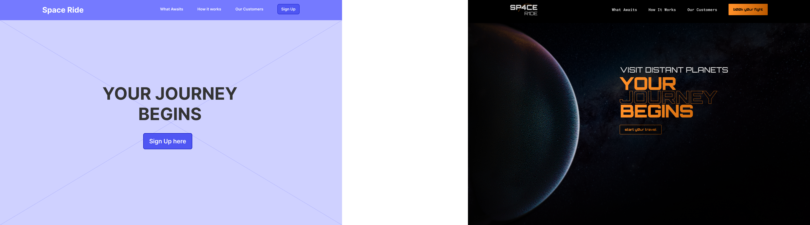

All wireframe can be found [here](https://github.com/dev-timm/space-ride/tree/main/assets/images/readme-images/wireframes)

### Visual Design
One key focus of the website is to build up excitement for space travel the moment the user enters the homepage. The experience should feel familiar by providing a sci-fi theme.

#### Fonts
The fonts used for the website are “Orbitron” and “Roboto Mono”. Both fonts have a very technical and futuristic look and feel which make them a perfect choice for a space travel product.

#### Colors
Like with the fonts, the colors provide a futuristic look and feel. The colors are also used to highlight important actions, e.g. CTAs.
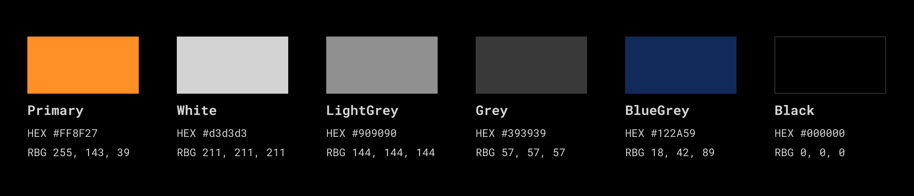

#### Accessibility
Colors have enough contrast and fonts are well readable to ensure the website is accessible even for users with impaired vision.

## Features
### Navigation Bar
The navigation is fixed on the top and accessible from every page. By clicking on an navigation item on the homepage it will lead the user to the dedicated section with a smooth scrolling effect. Moreover, the navigation is responsive and will turn into a burger menu when a certain display size is reached.


### Hero
The hero section contains a background image as well as the only h1 heading of the website. It also includes a CTA to help the user reach the registration page.
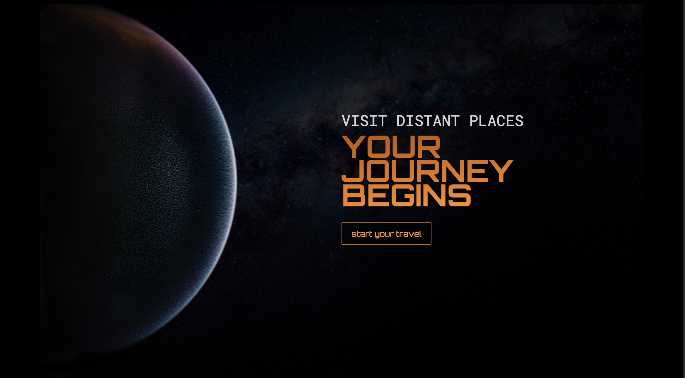

### What Awaits
The what awaits section contains a mix of text, image and icon. It is divided into sub-sections and it’s purpose is to communicate the value of the product.
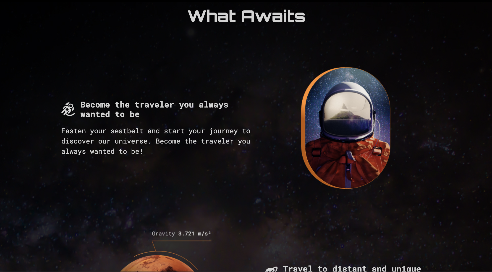

### How It Works
The how it works section is self explanatory as it explains the user the steps they have to go through for a successful application process. To make it more visual appealing each step has a individual icon.
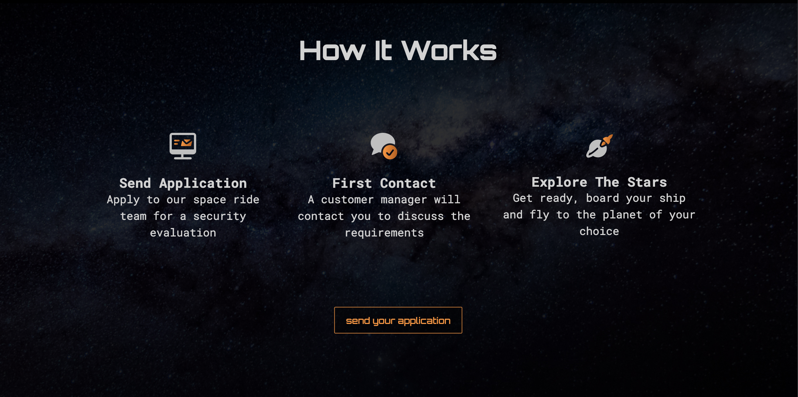

### Customer Reviews
To proof the value of the product to website visitor it’s important to display reviews written by previous customers. Each review is shown in a separate box and shows the text, a star rating and the name of the author.
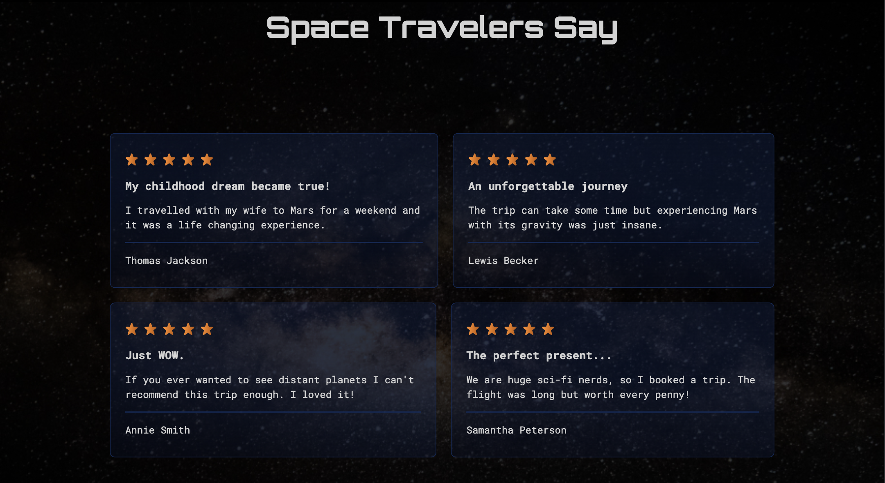

### Newsletter 
The newsletter section lets visitors sign up for the company’s newsletter to receive new updates about the product. Clicking at the submit button will lead the visitors to a confirmation page.
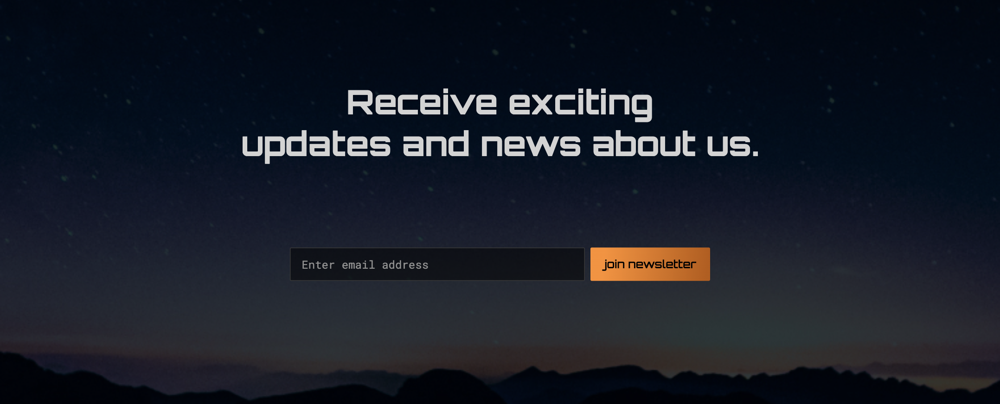

### Footer
At the end of the website is the footer that contains the copyright and links to SPACE R1DE’s social media accounts.


### Registration Page
After clicking one of the CTAs, visitors land on the registration page. On this page visitors can fill out a form with their name, email, phone number, number of attendees and which planet they want to visit. Clicking at the submit button at the end of the form will lead the visitors to a confirmation page.
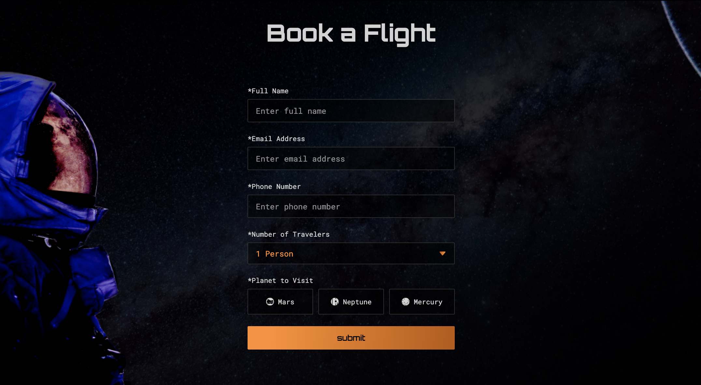

### Confirmation Page
The confirmation pages users see after submitting the registration form or newsletter serves as additional reassurance that the data was send successfully.
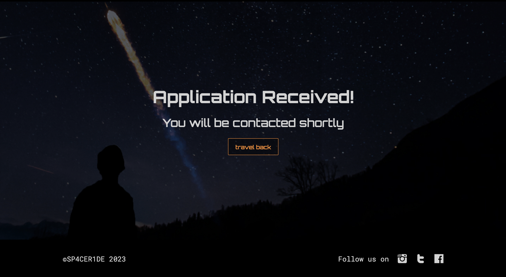

## Testing 
All pages where tested with the [Markup Validation Service](https://validator.w3.org/) and [CSS Validation Service](https://jigsaw.w3.org/css-validator/) and no errors were found.

### Lighthouse
The deployed website was also tested with Google Chrome's Lighhouse feature and all scores have been above 90 for both mobile and desktop.
#### Desktop
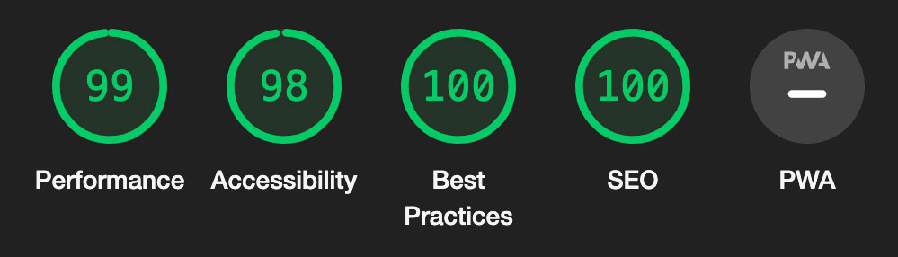
#### Mobile
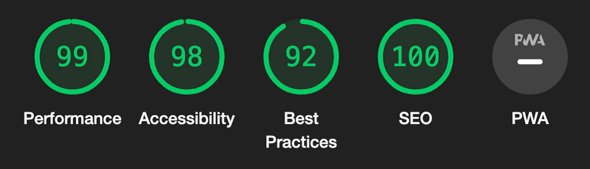

### Tested Devices with Browsers
- iPhone 11
    - Safari
- Macbook Pro 2019 16-inch
    - Chrome
    - Safari
    - Firefox
- iPad (5th generation)
    - Safari

### Feature Testing
| Feature | Action | Expected Behaviour | Pass/Fail
| --- | --- | --- | --- |
| Nav Bar | Click on logo | Opens homepage | Pass
| Nav Bar | Click on "What Awaits" link | scrolls down to "What Awaits" section | Pass
| Nav Bar | Click on "How It Works" link | scrolls down to "How It Works" section | Pass
| Nav Bar | Click on "Space Travelers Say" link | scrolls down to "Space Travelers Say" section | Pass
| Nav Bar | Click on "book your flight" button | Opens registration page | Pass
| Nav Bar | Reduce width of website to tablet size | Shows burger menu | Pass
| Nav Bar | Click on burger menu | Shows all navigation items | Pass
| Nav Bar | Click on burger menu when open | Closes navigation | Pass
| Hero | Click on "start your travel" button | Opens registration page | Pass
| What Awaits | Click on "get in contact" button | Opens registration page | Pass
| How It Works | Click on "send your application" button | Opens registration page | Pass
| Space Travelers Say | Click on "become a traveler" button | Opens registration page | Pass
| Newsletter | Add text which is not email format into the input field and click "join newsletter" button | Input field shows alert that text has to be in email format | Pass
| Newsletter | Add email address into the input field and click "join newsletter" button | Opens confirmation page | Pass
| Newsletter confirmation | Click on "travel back" button | Opens homepage | Pass
| Registration | Click on "submit" button | "Full Name" input field shows alert to fill in text | Pass
| Registration | Fill in "Full Name" and click on "submit" button | "Email Address" input field shows alert to fill in text | Pass
| Registration | Add text which is not email format and click submit button | Input field shows alert that text has to be in email format | Pass
| Registration | Add email address into the input field and click submit button | "Phone Number" input field shows alert to fill in text | Pass
| Registration | Fill in "Phone Number" and click on "submit" button | "Planet to Visit" radio buttons show alert to select one option | Fail
| Registration | Select one of the radio options and click submit button | Opens confirmation page | Pass
| Registration confirmation | Click on "travel back" button | Opens homepage | Pass
| Footer | Click on instagram icon | Opens instagram website in new tab | Pass
| Footer | Click on twitter icon | Opens twitter website in new tab | Pass
| Footer | Click on facebook icon | Opens facebook website in new tab | Pass

### Unfixed Bugs
Currently there is no visible alert when a user wants to submit the registration form without selecting one of the radio options first.

## Deployment
### Deploying the website to GitHub Pages:
1. Visit the GitHub page of the website’s repository
2. Click on “Settings”
3. Click on “Pages” inside the left sidebar
4. Make sure “Deploy from a branch” is selected under the "Source" section
5. Change branch from “None” to “main”
6. Click on the "Save" button
7. If everything's done right, in less than a minute a banner should appear on top of the same page containing the website's link (which is now hosted on GitHub Pages)

The link to the deployed website of this project can be found [here](https://dev-timm.github.io/space-ride/)

### Cloning the repository
1. Visit the GitHub page of the website’s repository
2. Click the “Clone” button on top of the page
3. Click on “HTTPS”
4. Click on the copy button next to the link to copy it
5. Open your IDE
6. Type ```git clone <copied URL>``` into the terminal

## Credits
### Images & Icons
- all images are taken from [unsplash.com](https://unsplash.com/)
- all icons are taken from [streamlinehq.com](https://www.streamlinehq.com/) via paid subscription

### Code
Solutions that helped me with: 
- [styling arrow for select tag](https://codepen.io/btn-ninja/pen/OJNrome)
- styling radio buttons - [here](https://stackoverflow.com/questions/5112995/how-to-replace-radio-buttons-with-images) and [here](https://stackoverflow.com/questions/17541614/use-images-instead-of-radio-buttons) 
- [creating mobile navigation using only html/css](https://www.youtube.com/watch?v=oLgtucwjVII)
- [redirecting the user from the form to the confirmation page](https://stackoverflow.com/questions/3303675/how-to-make-an-input-type-button-act-like-a-hyperlink-and-redirect-using-a-get-r)

### Thank You
- to my mentor Dick for supporting me with his feedback through the entire project
- to my love Valentina for making sure I always get the time and anything else I need for working on this course and projects
