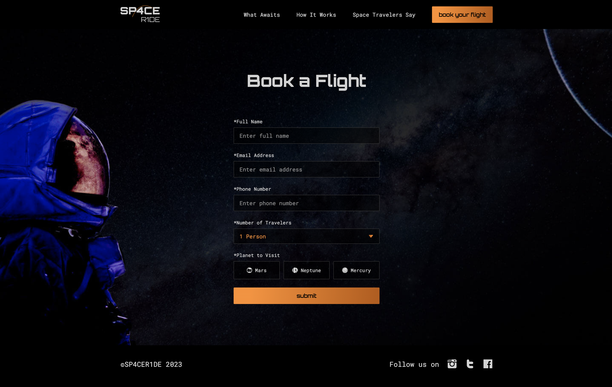
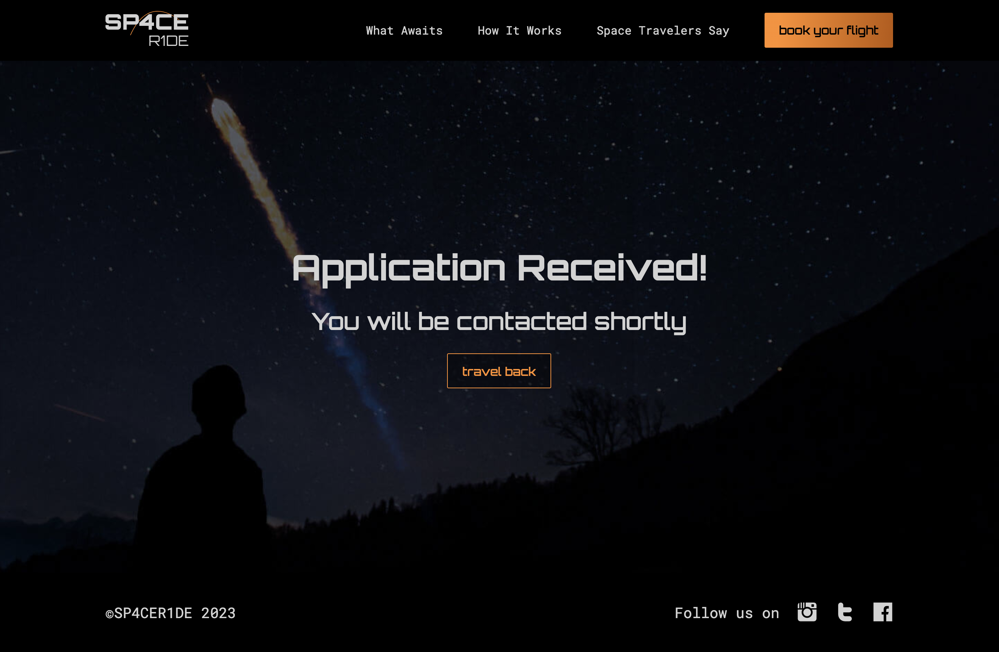
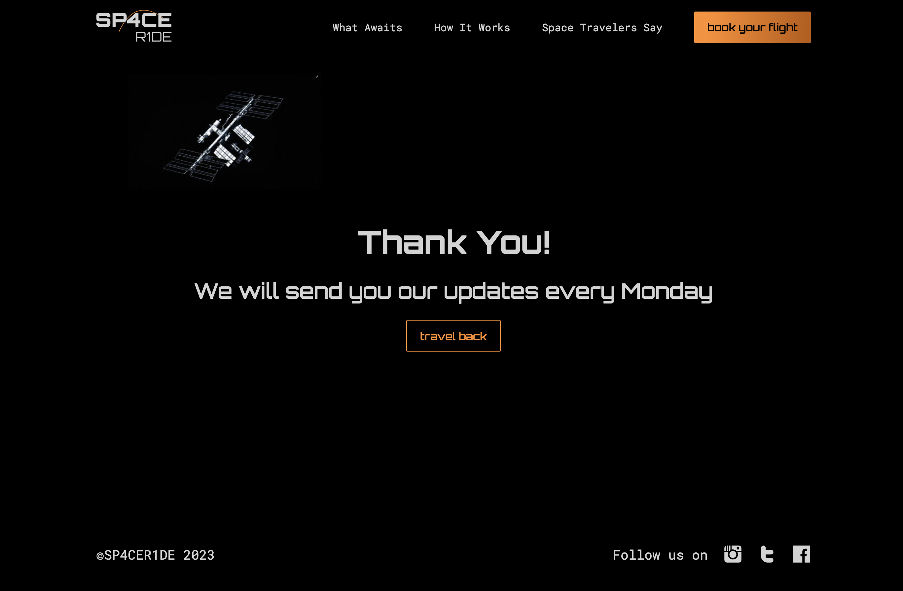

# SPACE R1DE
Welcome to SPACE R1DE, the product that helps you make your dreams come true and send you to space. 

SPACE R1DE was built to address the longing of people who want to travel beyond our planet and discover new places in our universe. During the registration process, customers have the option to choose among 3 different planets to travel to.

[Link to the website](https://dev-timm.github.io/space-ride/)


## Product Decisions 

### Business Needs
As a company we want to...
- be one of the first businesses that offer private space travel so that we can be ahead of the competition early on.
- appeal to our target audience from the very first page visit to make them excited about the product we are offering.
- make sure our product is secure so that our staff and customers feel safe far away from home.
- make it as easy as possible for potential customers to get in touch with us.
- increase the stickiness of our product so that we ensure the retention of our customers base.

### User Needs
As a space enthusiast I want to... 
- experience visiting other planets first hand so that I fulfil my childhood dreams.
- know what others say about their experience with space travel so that I can choose the best provider for my journey.
- know more about the process it would take to schedule a flight into space.
- be the first to know about space travelling and other related topics or news.

### MVP
For the first MVP version it was important to have an easy-to-navigate website which efficiently conveys key information. Moreover, the travel registration process is in the form of an application instead of booking the flight immediately to ensure the safety of all passengers. For all of those that aren't ready to book a flight with SPACE R1DE yet there is a newsletter subscription option which helps both website visitors and the company to stay in touch. In addition, there are reviews from previous customers sharing their experience with SPACE R1DE to encourage website visitors towards the application process.

## Design Decisions

### Design Process
To determine the best information architecture, it was important to build low-fi wireframes first. During this step it was crucial to focus only on the information that needs to be conveyed and leave out any visual/branding characteristics. 

After preparing the low-fi wireframes, they were developed into hi-fi wireframes including all visual details. 


All wireframes can be found [here](https://github.com/dev-timm/space-ride/tree/main/assets/images/readme-images/wireframes)

### Visual Design
One of the key purposes of the website is to build up excitement for space travel the moment the user visits the homepage. The sci-fi design theme makes the website more intriguing to the visitor.

#### Fonts
The fonts used for the website are [“Orbitron”](https://fonts.google.com/specimen/Orbitron?query=orbitron) and [“Roboto Mono”](https://fonts.google.com/specimen/Roboto+Mono?query=roboto+mono). Both fonts have a very technical and futuristic look and feel, which make them a perfect choice for a space travel product.

#### Colors
Like with the fonts, the colors provide a futuristic look and feel. They are also used to highlight important actions, e.g. buttons.


#### Accessibility
The color palette has sufficient contrast and the fonts are well readable which ensures the website is accessible even to the visitors with impaired vision.

## Features
### Navigation Bar
The navigation is fixed on the top and available on every page. By clicking on an navigation item the user is led to the dedicated homepage section with a smooth scrolling effect. Additionally there is a call-to-action button that helps the visitor access the registration page. 

Moreover, the navigation is responsive and will turn into a burger menu when a certain display size is reached.


### Hero
The background image's purpose is to excite the visitor about space travel. The section also includes a CTA to encourage the visitor to reach the registration page.


### What Awaits
The What Awaits section is a mix of text, images and icons. It's divided into sub-sections and its purpose is to communicate the value of the product.


### How It Works
The How It Works section aims to inform the user about the steps they have to go through for a successful booking application process. To make it more visually appealing an icon was added to each step.


### Customer Reviews
To demonstrate the value of the product to website visitors, reviews written by previous customers are displayed. Each review is shown in a separate box and includes a comment, a star rating and the name of the author.


### Newsletter 
The newsletter section gives visitors an opportunity to sign up for the company’s newsletter to receive new updates about the product and relevant content. After successfully subscribing to the newsletter, the user is redirected to a confirmation page.


### Footer
There is a footer at the bottom of each webpage that contains the copyrights and links to SPACE R1DE’s social media profiles.


### Registration Page
After clicking one of the CTA buttons, visitors land on the registration page. On this page visitors can fill out a form with their name, email, phone number, number of attendees and the planet they want to visit. The form validates user entries and informs about any incorrectly entered information via error messages. A successful form submission redirects the visitors to a confirmation page.



### Confirmation Pages
After submitting the registration form or subscribing to a newsletter, users are redirected to a matching confirmation page. These pages serve as an additional reassurance that the data was send successfully.





## Testing 
All webpages were tested with the [HTML Validator](https://validator.w3.org/) and [CSS Validator](https://jigsaw.w3.org/css-validator/) and no errors were found.

### Lighthouse
Each page of the deployed website has been tested multiple times with Google Chrome's Lighhouse feature to ensure all scores have been above 90 for both mobile and desktop devices.

Desktop


Mobile


### Tested Devices and Browsers
- iPhone 11
    - Safari
- Macbook Pro 2019 16-inch
    - Chrome
    - Safari
    - Firefox
- iPad (5th generation)
    - Safari

### Feature Testing
| Feature | Action | Expected Behaviour | Pass/Fail
| --- | --- | --- | --- |
| Navbar | Click on logo | Opens homepage | Pass
| Navbar | Click on "What Awaits" link | Scrolls down to "What Awaits" section on homepage| Pass
| Navbar | Click on "How It Works" link | Scrolls down to "How It Works" section on homepage | Pass
| Navbar | Click on "Space Travelers Say" link | Scrolls down to "Space Travelers Say" section on homepage | Pass
| Navbar | Click on "book your flight" button | Opens registration page | Pass
| Navbar | Reduce width of website to tablet size | Shows burger menu | Pass
| Navbar | Click on burger menu | Shows all navigation items | Pass
| Navbar | Click on burger menu when nav items are displayed | Closes navigation | Pass
| Hero | Click on "start your travel" button | Opens registration page | Pass
| What Awaits | Click on "get in contact" button | Opens registration page | Pass
| How It Works | Click on "send your application" button | Opens registration page | Pass
| Space Travelers Say | Click on "become a traveler" button | Opens registration page | Pass
| Newsletter | Add text which is not email format into the input field and click "join newsletter" button | Input field shows error message | Pass
| Newsletter | Add email address into the input field and click "join newsletter" button | Opens confirmation page | Pass
| Newsletter confirmation page | Click on "travel back" button | Opens homepage | Pass
| Registration page | Click on "submit" button | "Full Name" input field shows error message | Pass
| Registration page | Fill in "Full Name" and click on "submit" button | "Email Address" input field shows error message | Pass
| Registration page | Add text which is not email format and click "submit" button | Input field shows error message | Pass
| Registration page | Add email address into the input field and click "submit" button | "Phone Number" input field shows error message | Pass
| Registration page | Fill in "Phone Number" and click on "submit" button | "Planet to Visit" radio buttons show error message | Fail
| Registration page | Select one of the radio options and click "submit" button | Opens confirmation page | Pass
| Registration confirmation page | Click on "travel back" button | Opens homepage | Pass
| Footer | Click on Instagram icon | Opens Instagram's website in new tab | Pass
| Footer | Click on Twitter icon | Opens Twitter's website in new tab | Pass
| Footer | Click on Facebook icon | Opens Facebook's website in new tab | Pass

### Unfixed Bugs
Currently there is no visible error message when a user wants to submit the registration form without selecting one of the radio options first. As the radio buttons were customized this usualy a default browser behaviour has been affected. Unfortunatily there was no time to dig deeper into this issue.

## Deployment
### Deploying the website to GitHub Pages:
1. Visit the GitHub page of the website’s repository
2. Click on “Settings”
3. Click on “Pages” inside the left sidebar
4. Make sure “Deploy from a branch” is selected under the "Source" section
5. Change branch from “None” to “main”
6. Click on the "Save" button
7. If everything's done right, in less than a minute a banner should appear on top of the same page containing the website's link (which is now hosted on GitHub Pages)

The link to the deployed website of this project can be found [here](https://dev-timm.github.io/space-ride/)

### Cloning the repository
1. Visit the GitHub page of the website’s repository
2. Click the “Clone” button on top of the page
3. Click on “HTTPS”
4. Click on the copy button next to the link to copy it
5. Open your IDE
6. Type ```git clone <copied URL>``` into the terminal

## Credits
### Images & Icons
- all images are taken from [unsplash.com](https://unsplash.com/)
- all icons are taken from [streamlinehq.com](https://www.streamlinehq.com/) via paid subscription

### Code
Solutions that helped me with: 
- [styling arrow for select tag](https://codepen.io/btn-ninja/pen/OJNrome)
- styling radio buttons - [here](https://stackoverflow.com/questions/5112995/how-to-replace-radio-buttons-with-images) and [here](https://stackoverflow.com/questions/17541614/use-images-instead-of-radio-buttons) 
- [creating mobile navigation using only html/css](https://www.youtube.com/watch?v=oLgtucwjVII)
- [redirecting the user from the form to the confirmation page](https://stackoverflow.com/questions/3303675/how-to-make-an-input-type-button-act-like-a-hyperlink-and-redirect-using-a-get-r)

### Thank You
- to my mentor Dick for supporting me with his feedback through the entire project
- to my love Valentina for making sure I always get the time and anything else I need for working on this course and projects
