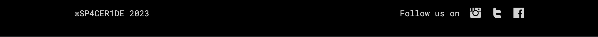

# SPACE R1DE
Welcome to SpaceR1de, the product that helps you make your dreams come true and send you to space. 

SpaceR1de was built to address the longing of people who want to travel beyond our planet and discover new places in our universe. After the successful registration process customers have the option to select between 3 different planets to travel. 

## Product Decisions 

### Business Needs
As a company...
- we want to be one of the first businesses that offer private space travel so that we can be ahead of the competition early on.
- we want to appeal to our target audience from the very first page visit to make them excited about the product we are offering.
- we want to make sure our product is secure so that our staff and customers feel safe far away from home.
- we want to make it as easy as possible for potential customers to get in touch with us.
- we want to increase the stickiness of our product so that we ensure the retention of our customers base.

### MVP
For the first MVP it was important to have an easy to navigate website which efficiently conveys key information. 

## Design Decisions

### User Needs
As a space enthusiast I want to... 
- experience visiting other planets first hand so that I fulfil my childhood dreams.
- know what others say about their experience with space travel so that I can choose the best provider for my journey
- know more about the process it would take to schedule a flight into space.
- be the first to know about space travelling and other related topics or news.

### Design Process
To determine the best information architecture, it was important to first build low-fi wireframes. A crucial step for this was to make sure to only focus on the information that needs to be conveyed and leave out and visual decsions. After that was done the low-fi wireframes could be turned into hi-fi wireframes including all visual details. 

### Visual Design
One key focus of the website is to build up excitement for space travel the moment the user enters the homepage. The experience should feel familiar by providing a sci-fi theme.

#### Fonts
The fonts used for the website are “Orbitron” and “Roboto Mono”. Both fonts have a very technical and futuristic look and feel which make them a perfect choice for a space travel product.

#### Colors
Like with the fonts, the colors provide a futuristic look and feel. They also highlight important actions e.g. CTAs as well as interactive elements such as input fields.

#### Accessibility
Colors have enough contrast and fonts are well readable to ensure the website is accessible even for users with impaired vision.

## Features
### Navigation Bar
The navigation is fixed on the top and accessible from every page. By clicking on an navigation item on the homepage it will lead the user to the dedicated section with a smooth scrolling effect. Moreover, the navigation is responsive and will turn into a burger menu when a certain display size is reached.

### Hero
The hero section contains a background image as well as the only h1 heading of the website. It also includes a CTA to help the user reach the registration page.

### What Awaits
The what awaits section contains a mix of text, image and icon. It is divided into sub-sections and it’s purpose is to communicate the value of the product.

### How It Works
The how it works section is self explanatory as it explains the user the steps they have to go through for a successful application process. To make it more visual appealing each step has a individual icon.

### Customer Reviews
To proof the value of the product to website visitor it’s important to display reviews written by previous customers. Each review is shown in a separate box and shows the text, a star rating and the name of the author.

### Newsletter 
The newsletter section lets visitors sign up for the company’s newsletter to receive new updates about the product. Clicking at the submit button will lead the visitors to a confirmation page.

### Footer
At the end of the website is the footer that contains the copyright and links to Spaces R1de’s social media accounts.

### Registration Page
After clicking one of the CTAs, visitors land on the registration page. On this page visitors can fill out a form with their name, email, phone number, number of attendees and which planet they want to visit. Clicking at the submit button at the end of the form will lead the visitors to a confirmation page.

### Confirmation Page
The confirmation pages users see after submitting the registration form or newsletter serves as additional reassurance that the data was send successfully.
